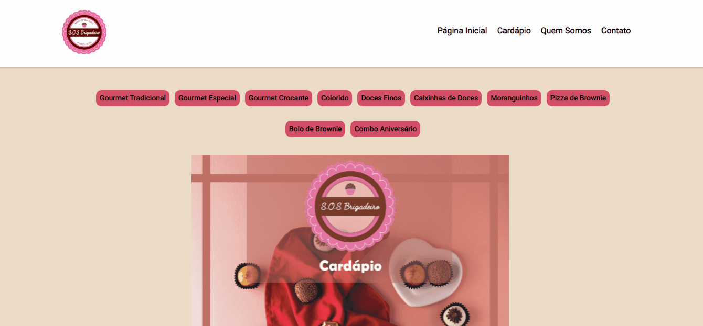
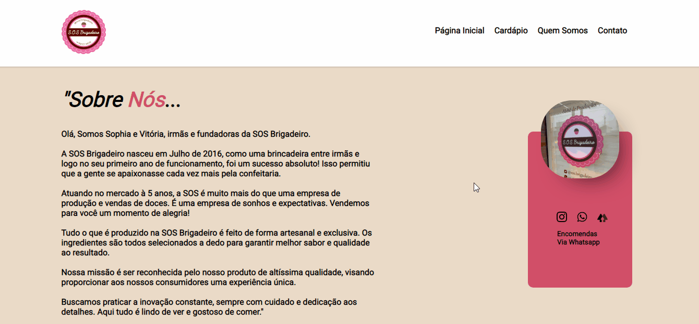

<h3 align="center">
    
    <br><br>
</h3>

## 🔖 Informaçoes sobre a S.O.S Brigadeiro <br/>

A <strong>SOS</strong> é uma empresa de produção de doces. <br><br>

## 🖼 Screenshot das telas do site <br/>

<br><br>
<br><br>

<br/><br>

## 🚀 Tecnologias utilizadas <br/>
<br/>

- HTML <br/>
- CSS <br/>
<br/>

## 👨‍💻 Skills Praticadas

  - ✔️ CSS - Flexbox and Grid 
  - ✔️ Layout Responsive
<br><br><br>

 # 👷 Como rodar

```bash
# Clonar o repositório
git clone https://github.com/carlosfilhou/sos-brigadeiro

# Entrar numa IDE de sua preferência 

# Executar o servidor ou usar um puglin que criar um servidor

```


## 🤔 Como contribuir <br/>

- Faça um fork desse repositório; <br/>
- Cria uma branch com a sua feature: `git checkout -b minha-feature`;<br/>
- Faça commit das suas alterações: `git commit -m 'feat: Minha nova feature'`; <br/>
- Faça push para a sua branch: `git push origin minha-feature`.<br/>
<br/>
Depois que o merge da sua pull request for feito, você pode deletar a sua branch. <br/>


## 🎓 Autores

<table align="center">
    <tr>
        <td align="center">
            <a href="https://github.com/carlosfilhou">
                
                <br />
            </a>
        </td>    
    </tr>
</table>
<h4 align="center">
   by  <a href="https://www.linkedin.com/in/carlosfilhou/" target="_blank"> Carlos Filho </a>
</h4>
